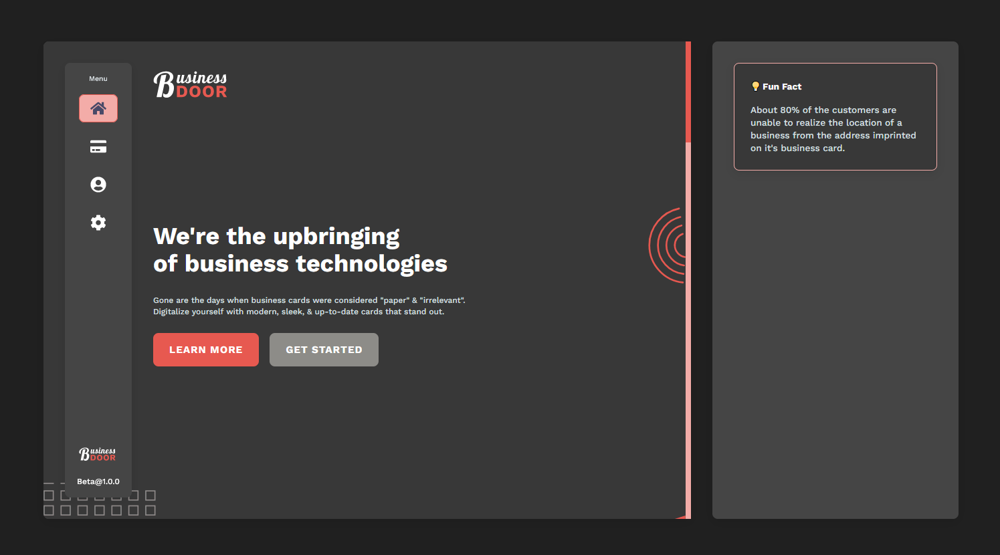

<div id="top"></div>

<!-- PROJECT SHIELDS -->

[![Contributors][contributors-shield]][contributors-url]
[![Forks][forks-shield]][forks-url]
[![Stargazers][stars-shield]][stars-url]
[![Issues][issues-shield]][issues-url]
[![MIT License][license-shield]][license-url]
[](https://app.netlify.com/sites/dev-business-door/deploys)

<!-- PROJECT LOGO -->
<br />
<div style="text-align: center">
  <a href="https://github.com/devshot-dotcom/business-door">
    
  </a>

  <p style="text-align: center">
    Digital business cards & Business management.
    <br />
    <a href="https://dev-business-door.netlify.app">View the site</a>
    ·
    <a href="https://github.com/devshot-dotcom/business-door/issues">Report a bug</a>
    ·
    <a href="https://github.com/devshot-dotcom/business-door/issues">Request a feature</a>
  </p>
</div>

<!-- TABLE OF CONTENTS -->
<details>
  <summary>Table of Contents</summary>
  <ol>
    <li>
      <a href="#about-the-project">About The Project</a>
      <ul>
        <li><a href="#built-with">Built With</a></li>
      </ul>
    </li>
    <li>
      <a href="#getting-started">Getting Started</a>
      <ul>
        <li><a href="#prerequisites">Prerequisites</a></li>
        <li><a href="#installation">Installation</a></li>
        <li><a href="#additional-steps">Additional Steps</a></li>
      </ul>
    </li>
    <!-- <li><a href="#usage">Usage</a></li>
    <li><a href="#roadmap">Roadmap</a></li> -->
    <li><a href="#contributing">Contributing</a></li>
    <li><a href="#license">License</a></li>
    <li><a href="#contact">Contact</a></li>
    <li><a href="#acknowledgments">Acknowledgments</a></li>
  </ol>
</details>

<!-- ABOUT THE PROJECT -->

## About The Project



Since the advent of smartphones, business cards and their needs are on the decline. Most of our routine-life activities are being replaced by smartphones or their competitive counterparts. It wouldn't be wrong to say that the internet has overtaken our lives and some things need to be remade and re-introduced.

Hence, we introduce digital business cards that aren't your ordinary paper cards, with an evergrowing supply of templates and professional designs that hold the power to make your eyes pause for a moment. The workflow is as simple as creating an account for google;

1. Create an account.

2. Set up your profile.

3. Select & Edit a card template.

4. Share, print, or download the card.

<p align="right">(<a href="#top">back to top</a>)</p>

### Built With

- [React.js](https://reactjs.org/) as the library.
- [Supabase](https://supabase.com) as the database.

<p align="right">(<a href="#top">back to top</a>)</p>

<!-- GETTING STARTED -->

## Getting Started

We've got you covered in case you want to setup the app for yourself on your local machine. Follow these simple steps:

### Pre-requisites

Firstly, visit [supabase](https://app.supabase.io) and create yourself a new account/log in before creating a new project. Visit the [official docs](https://supabase.com/docs) to learn more. Once you're done with the project initialization, you'll be given a `URL` that points to your project and an `ANON_KEY` that is the public API key for your project. Hold onto these for a while.

Lastly, make sure you have [nodejs](https://nodejs.org/en/) installed and you have access to atleast one of `npm` or `yarn`. You can check the installation by typing `node -v` in a terminal.

### Installation

1. Clone the repo:

   ```sh
   git clone https://github.com/devshot-dotcom/business-door.git
   ```

2. Select the directory in the terminal:

   ```sh
   cd business-door
   ```

3. Install the dependancies:

   ```sh
   npm install
   ```

   or

   ```sh
   yarn install
   ```

4. Create a `.env` file and place the variables you received from supabase as follows:

   ```py
   REACT_APP_DATABASE_URL=<your-project-url>
   REACT_APP_DATABASE_KEY=<your-api-key>
   ```

5. Start the development server and you're good to go:

   ```sh
   npm start
   ```

   or

   ```sh
   yarn start
   ```

<p align="right">(<a href="#top">back to top</a>)</p>

### Additional Steps

You will need to create tables and insert data in the `supabase.storage` buckets to be able to successfully use the app's API. Further information on this will be presented soon.

<p align="right">(<a href="#top">back to top</a>)</p>

<!-- USAGE EXAMPLES -->

<!-- ## Usage

Use this space to show useful examples of how a project can be used. Additional screenshots, code examples and demos work well in this space. You may also link to more resources.

_For more examples, please refer to the [Documentation](https://example.com)_

<p align="right">(<a href="#top">back to top</a>)</p> -->

<!-- ROADMAP -->

<!-- ## Roadmap

- [ ] Feature 1
- [ ] Feature 2
- [ ] Feature 3
  - [ ] Nested Feature

See the [open issues](https://github.com/devshot-dotcom/business-door/issues) for a full list of proposed features (and known issues).

<p align="right">(<a href="#top">back to top</a>)</p> -->

<!-- CONTRIBUTING -->

## Contributing

Contributions are what make the open source community such an amazing place to learn, inspire, and create. Any contributions you make are **greatly appreciated**.

If you have a suggestion that would make this better, please fork the repo and create a pull request. You can also simply open an issue with the tag "enhancement".

Don't forget to give the project a star! Thanks again!

1. Fork the Project
2. Create your Feature Branch (`git checkout -b feature/AmazingFeature`)
3. Commit your Changes (`git commit -m 'Add some AmazingFeature'`)
4. Push to the Branch (`git push origin feature/AmazingFeature`)
5. Open a Pull Request

<p align="right">(<a href="#top">back to top</a>)</p>

<!-- LICENSE -->

## License

Distributed under the MIT License. See `LICENSE.txt` for more information.

<p align="right">(<a href="#top">back to top</a>)</p>

<!-- CONTACT -->

## Contact

For inquiries, contact [devshot.coffee@gmail.com](mailto://devshot.coffee@gmail.com)
Project Link: [https://github.com/devshot-dotcom/business-door](https://github.com/devshot-dotcom/business-door)

<p align="right">(<a href="#top">back to top</a>)</p>

<!-- ACKNOWLEDGMENTS -->

## Acknowledgments

Thanks to all of these projects and people who have contributed to them:

- [Fontawesome](https://fontawesome.com)
- [html2canvas](https://html2canvas.hertzen.com/)
- [SASS](https://sass-lang.com/) (Can't keep calm without saying Sassy CSS 😂)
- [React-Modal](https://reactcommunity.org/react-modal/)
- [React-Qr-Code](https://github.com/rosskhanas/react-qr-code)
- [React-Router](https://reactrouter.com/)

<p align="right">(<a href="#top">back to top</a>)</p>

<!-- MARKDOWN LINKS & IMAGES -->
<!-- https://www.markdownguide.org/basic-syntax/#reference-style-links -->

[contributors-shield]: https://img.shields.io/github/contributors/devshot-dotcom/business-door.svg?style=for-the-badge
[contributors-url]: https://github.com/devshot-dotcom/business-door/graphs/contributors
[forks-shield]: https://img.shields.io/github/forks/devshot-dotcom/business-door.svg?style=for-the-badge
[forks-url]: https://github.com/devshot-dotcom/business-door/network/members
[stars-shield]: https://img.shields.io/github/stars/devshot-dotcom/business-door.svg?style=for-the-badge
[stars-url]: https://github.com/devshot-dotcom/business-door/stargazers
[issues-shield]: https://img.shields.io/github/issues/devshot-dotcom/business-door.svg?style=for-the-badge
[issues-url]: https://github.com/devshot-dotcom/business-door/issues
[license-shield]: https://img.shields.io/github/license/devshot-dotcom/business-door.svg?style=for-the-badge
[license-url]: https://github.com/devshot-dotcom/business-door/blob/master/LICENSE.txt
[linkedin-shield]: https://img.shields.io/badge/-LinkedIn-black.svg?style=for-the-badge&logo=linkedin&colorB=555
[linkedin-url]: https://linkedin.com/in/linkedin_username
[product-screenshot]: images/screenshot.png
